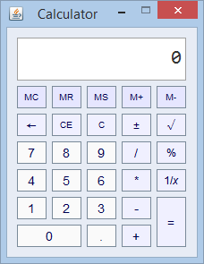

# Calculator
A simple Windows calculator clone.

Provides operations found in the Standard view of the Windows calculator program, trying to simulate its behavior as close as possible. Written in Java with the use of Swing.

Implemented functions:
- arithmetic operations (addition, subtraction, multiplication, division);
- reciprocal, percentage, square root;
- memory manipulation (save, recall, add, subtract).
